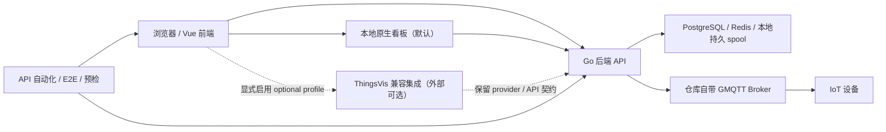

# AetherLink IoT

[](https://github.com/shine-233/aetherlink-iot/actions/workflows/minimum-quality-gate.yml) [](https://github.com/shine-233/aetherlink-iot/actions/workflows/source-ci.yml) [](https://github.com/shine-233/aetherlink-iot/actions/workflows/codeql.yml) [](LICENSE)

       

开源自托管 IoT 平台：Vue 3 前端控制台 + Go 后端 API + 基于 GMQTT 的 MQTT Broker，覆盖设备接入、遥测、命令、告警、OTA、多租户权限、自动化场景与看板，默认单机 Docker Compose 即可跑起来。

<!-- TODO(截图)：栈跑起来后补两张图到 docs/screenshots/（控制台首页、设备详情），放在"快速开始"之后效果最好 -->

## ⚡ 快速开始

```bash
git clone https://github.com/shine-233/aetherlink-iot.git
cd aetherlink-iot

# Linux / macOS
./start-aetherlink.sh

# Windows（CMD 或 PowerShell）
.\start-aetherlink.cmd
```

一键脚本会依次完成：环境预检（doctor）→ 生成带随机密钥的 `.env` → 启动 Compose 全栈 → 归档启动健康证据。完成后浏览器打开：

| 入口 | 地址 |
| --- | --- |
| Web 控制台 | http://localhost:8080 |
| 后端 API | http://localhost:9999 |
| 设备 MQTT 接入 | localhost:1883 |

首台设备的接入闭环见 [START-HERE.md](START-HERE.md)；服务器部署（公网 IP、绑定地址、性能档位）同样从该文件进入。

## 功能特性

- **设备全生命周期**：接入、配置、物模型、管理、共享、遥测、属性、命令、事件、告警与 OTA。
- **多租户后台**：租户/用户/角色/权限（Casbin RBAC）、系统管理与操作审计。
- **自动化场景**：联动规则、可视化条件编辑与定时触发。
- **设备影子**：离线命令缓存——设备不在线时下发自动入队，重新上线后按 TTL 自动投递。
- **可视化**：默认内置本地原生看板；可选启用 ThingsVis 兼容集成。
- **MQTT Broker**：插件化认证与 ACL、上下行路由、主题映射、持久化队列与会话撤销。
- **开放能力**：OpenAPI 密钥（哈希存储）、协议插件、数据脚本引擎。

产品演进计划见 [ROADMAP.md](ROADMAP.md)：对标 ThingsBoard CE / ThingsPanel 的功能差距矩阵与 Phase A/B/C 分阶段交付清单。

## 系统架构



前端负责展示与交互，后端承载领域规则、租户权限与持久化，Broker 负责 MQTT 接入与消息链路；ThingsVis、SMTP、地图等外部能力均为显式可选，未配置时明确报告 `disabled` / `configuration-required`，不会伪装成功。

## 仓库结构

| 路径 | 说明 |
| --- | --- |
| `frontend/` | Vue 3 + TS + Vite 控制台与可视化页面 |
| `backend/` | Go API、业务服务、DAL 与迁移（Gin + GORM + PostgreSQL） |
| `mqtt-broker/` | 基于 GMQTT 的 Broker 运行时与插件 |
| `automation_tests/` | API 自动化、Playwright E2E、预检与覆盖契约 |
| `deploy/` | 一键初始化、doctor 预检、备份恢复与性能档位 |
| `references/` | 文档地图与工程规则 |

## 开发调试

```bash
# 前端
cd frontend && pnpm install && pnpm dev

# 后端（需先准备 backend/configs/ 的 PG/Redis/MQTT 配置；
# 出厂 conf.yml 的 jwt.key 为占位符，启动会被 fail-fast 拒绝，
# 本地请先设置强密钥，例如 PowerShell：$env:GOTP_JWT_KEY = "<openssl rand -base64 48 的输出>"）
cd backend && go run .

# Broker
cd mqtt-broker && go run ./cmd/gmqttd
```

代码结构与模块职责的完整导航见 [CODE_WIKI.md](CODE_WIKI.md)。

## 测试与质量门禁

- 每个 PR 强制通过 14 项检查：前端 lint/typecheck/Vitest/build、后端与 Broker Go 测试、容器构建、CodeQL（含 fail-closed 告警门禁）、依赖审查与离线发布预检。
- 测试资产规模：后端 235 个 Go 测试文件、Broker 70 个、前端 404 个 Vitest 文件、API 自动化约 650 条断言、E2E 20 组规格共 78 个用例、373 条端点覆盖目录。
- 注意：以上为离线门禁与静态证据；真实设备链路、目标服务器部署与生产验收的状态以 [VALIDATION.md](VALIDATION.md) 为准。

自动化测试的运行前提与执行顺序见 [automation_tests/README.md](automation_tests/README.md)，CI 之外的完整自托管栈验证由 nightly `compose-stack-e2e` 流水线执行。

## 路线图

详细计划与交付记录见 [ROADMAP.md](ROADMAP.md)。当前节奏：

| 阶段 | 周期 | 重点 |
| --- | --- | --- |
| Phase A（进行中） | 1-2 个迭代 | 空租户守卫全量移植、**设备影子**（离线命令缓存，差异化能力）、空态覆盖 |
| Phase B | 3-5 个迭代 | Modbus TCP 插件（gRPC 独立进程）、可视化规则链编辑器（Vue Flow）、计算字段 |
| Phase C | 远期 | TimescaleDB 后端、租户层级、TresJS 3D 面板、AI 查询遥测 |

竞品定位与差距核对（ThingsBoard CE/PE、ThingsPanel 社区版）也记录在 ROADMAP.md 顶部。

## 文档导航

| 文档 | 用途 |
| --- | --- |
| [START-HERE.md](START-HERE.md) | 一键部署、服务器 IP 配置与首台设备接入 |
| [TESTING-AND-DEPLOYMENT.md](TESTING-AND-DEPLOYMENT.md) | 干净机器上的部署/测试分层排查路径 |
| [VALIDATION.md](VALIDATION.md) | 验证门槛、当前已测/未测清单 |
| [ROADMAP.md](ROADMAP.md) | 能力规划入口（设备 twin、fleet 批量治理、OTA 治理等） |
| [CODE_WIKI.md](CODE_WIKI.md) | 代码结构导航 |
| [COMPATIBILITY.md](COMPATIBILITY.md) | Broker 插件 / ThingsVis / telemetry gRPC 外部契约 |
| [GENERATED_FILES.md](GENERATED_FILES.md) | 生成文件的保留与再生成策略 |
| [CONTRIBUTING.md](CONTRIBUTING.md) · [SECURITY.md](SECURITY.md) · [PUBLICATION.md](PUBLICATION.md) | 协作规范、安全策略与公开边界 |

## 当前状态与边界

- 源码离线门禁持续保持绿色，但**这不等于**真实 API、浏览器 E2E、真机 RDI 或生产环境已验收。
- 真实 RDI 设备、目标服务器部署、HTTPS/TLS、公网 MQTT 与 backup/restore 目前为 `not-tested` / `pending` / `configuration-required`，逐项状态见 [VALIDATION.md](VALIDATION.md)。
- 数据库迁移链当前到 `53.sql`；升级 OpenAPI 密钥为哈希存储后，旧明文密钥需重新生成方可继续使用。

## 贡献

欢迎 Issue 与 PR。约定很简单：先读对应目录 README 再改代码；涉及兼容面先核对 [COMPATIBILITY.md](COMPATIBILITY.md)；接口或行为变化必须同步注释与测试。更完整的协作规范见 [CONTRIBUTING.md](CONTRIBUTING.md)。

## 许可证

[Apache-2.0](LICENSE)
