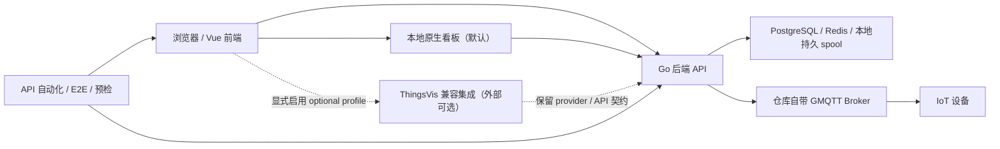

# AetherLink IoT

> 只想先把系统部署起来？直接看 [START-HERE.md](START-HERE.md)。它给出 Windows / Linux / macOS 的复制粘贴命令、服务器 IP 填法、启动后访问地址和首台设备闭环路径。

> 想从一台干净机器完整判断“能不能部署、测试失败属于哪一层”？看 [TESTING-AND-DEPLOYMENT.md](TESTING-AND-DEPLOYMENT.md)。它按当前 Docker Compose dev 流程串起 doctor、健康检查、首台设备、源码测试、API/E2E 和逐页浏览器证据。

> 进入人工开源 review 前，先看 [OPEN-SOURCE-REVIEW.md](OPEN-SOURCE-REVIEW.md)。它说明源码快照的保留/排除边界，以及为什么“可 review”不等于“生产已验收”。

AetherLink IoT 是一个面向物联网平台场景的完整源码仓库，包含 Vue 3 前端控制台、Go 后端服务、基于 GMQTT 的 MQTT Broker 集成、自动化验证资产，以及一套用于 GitHub 发布准备的兼容性、验证与第三方说明文档。

> 当前仓库正在进行“全面中文文档化 + 标准化 + 低风险静态重构”整理。当前成果主要提升源码可读性、目录说明完整性和维护边界清晰度；在统一验证完成前，不应把这些静态成果直接等同于“发布就绪”。

## 项目概述

这个仓库围绕典型 IoT 平台的核心能力展开，重点覆盖：

- 设备接入、配置、管理、共享、遥测、命令、事件、告警和 OTA。
- 多租户后台 API、权限控制、自动化场景、看板和系统管理。
- MQTT Broker 插件化集成、设备认证、ACL、上下行消息路由和调试钩子。
- 默认可用的本地原生看板，以及显式启用的 ThingsVis 兼容集成、运行时桥接和数据源对接。
- API 自动化、Playwright E2E、覆盖契约、预检与验证归档。

默认部署只依赖 PostgreSQL、Redis、本地 MQTT Broker、后端和前端，原生看板是默认本地可视化实现。仓库中的 ThingsVis 与 HTTP adapter 代码保留宿主侧/客户端接口契约；生产 ThingsVis Server、Studio 和 HTTP adapter runtime 来自显式启用的外部镜像。真实 SMTP、Market 服务端和地图 SDK 同样属于外部可选能力，缺失时必须显示 `disabled`、`configuration-required` 或 `blocked`，不能伪装成本地成功。

## 仓库结构

| 路径 | 功能定位 |
| --- | --- |
| `frontend/` | Vue 3 + TypeScript + Vite 前端控制台与可视化页面。 |
| `backend/` | Go 后端 API、业务服务、DAL、初始化逻辑和部署配置。 |
| `mqtt-broker/` | 基于 GMQTT 的 Broker 运行时、插件和 MQTT 协议相关实现。 |
| `automation_tests/` | API 自动化、Playwright E2E、预检脚本与覆盖契约。 |
| `references/` | 客户需求唯一权威清单、文档地图、工程规则和历史兼容快照。 |
| `verification/` | 本地验证归档目录，仅保存验证证据，不直接代表发布结论。 |
| `audit_reports/` | 已退役的历史审查目录，仅保留旧入口迁移说明。 |

> 目录与约定：客户需求与进度以 [`references/客户需求主清单-进度总表.md`](references/客户需求主清单-进度总表.md) 为唯一入口，覆盖 REQ-01 ~ REQ-58 全部状态；文档职责以 [`references/文档地图.md`](references/文档地图.md) 为准。`audit_reports/` 不再承载现行状态或验证证据。

## 核心功能

### 前端控制台

- 设备管理、设备详情、物模型、配置、服务、共享和告警页面。
- 自动化场景编辑、联动规则和可视化交互配置。
- 默认本地原生看板；显式启用兼容配置后可接入 ThingsVis 页面、编辑器和平台桥接。
- 多租户登录、路由权限、工作台与管理台页面。

### 后端服务

- 租户、用户、角色、权限和系统级管理。
- 设备、产品、遥测、看板、自动化、告警、通知和 OTA。
- OpenAPI、脚本/可视化相关服务，以及与 Broker 的协同接口。

### Broker 集成

- MQTT 协议运行时、插件加载、认证与 ACL。
- 设备消息上下行、联邦、主题映射、保留消息和持久化队列。

### 自动化验证资产

- API 自动化、E2E 页面流、覆盖分类、预检和归档脚本。
- 用于发布前的证据补齐，而不是替代真实业务断言本身。

## 安装与使用指南

普通单机部署请优先阅读 [`deploy/README.md`](deploy/README.md)，使用一键预检、生成 `.env`、启动 Compose 栈和归档启动证据。下面的前端、后端和 Broker 分模块启动方式主要用于开发调试。

### 环境准备

开发源码时建议准备：

- Node.js 与包管理器（`pnpm` / `npm`）
- Go 工具链
- 默认核心栈使用的 PostgreSQL、Redis 和仓库自带 MQTT Broker；普通部署优先由 Docker Compose 提供
- 本地配置文件、测试账号、必要的密钥与证书

ThingsVis、HTTP adapter、Market、SMTP 和地图 provider 不属于默认核心启动依赖。它们保留接口契约，并通过可选 Compose profile 或显式配置启用；未配置时应报告禁用、待配置或外部阻断，而不是阻止核心平台启动。文件、OTA 与遥测降级数据默认使用本地卷和持久 spool，不要求额外对象存储服务。

敏感配置请始终保留在本地，不要提交：

- `.env`
- 私钥、JWT 密钥、数据库密码
- 云存储凭据、第三方服务密钥
- 带真实公网地址的部署配置

### 前端启动

```bash
cd frontend
pnpm install
pnpm dev
```

### 后端启动

```bash
cd backend
go run .
```

启动前请先根据 `backend/configs/` 准备 PostgreSQL、Redis、MQTT 和鉴权配置。默认部署使用本地卷与持久 spool，不要求额外对象存储服务；外部 provider 仅在显式启用时配置。

### Broker 启动

```bash
cd mqtt-broker
go run ./cmd/gmqttd
```

### 自动化验证

自动化目录只应在本地服务、测试账号和代理配置都齐备后再执行。建议先读：

- [VALIDATION.md](VALIDATION.md)
- [automation_tests/README.md](automation_tests/README.md)

## 系统架构



高层职责划分如下：

- 前端负责页面展示、交互状态、路由权限、接口调用和可视化集成。
- 后端负责领域规则、租户权限、数据持久化、自动化、告警、OTA 和对外 API。
- Broker 负责 MQTT 设备接入和消息链路。
- 自动化资产负责验证证据，但只有在断言、负例、数据种子和归档齐备时，才能支撑业务闭环结论。

## 模块说明

### `frontend/`

真实业务页面较多，当前重点热点集中在：

- `src/views/device/`
- `src/views/automation/`
- `src/core/data-architecture/`
- `src/utils/thingsvis/`

这些区域已经在持续补充中文文件头、复杂逻辑说明和静态重构建议。

### `backend/`

当前最值得持续审查的热点集中在：

- `internal/service/`
- `internal/dal/`
- `internal/api/`

其中 `service` 更偏业务编排，`dal` 更偏查询与数据过滤，是后续补测试与提升稳定性的关键位置。

### `mqtt-broker/`

这里包含大量子目录 README，适合继续做目录级文档标准化，但涉及协议兼容、插件标识和持久化格式时必须慎改。

### `automation_tests/`

这里不仅是测试脚本仓库，也是覆盖分类、业务能力映射和预检流程的证据层。绿色覆盖率本身不等于业务闭环，需要结合能力映射、真实断言和归档证据一起看。

## 当前重构计划

| 模块 | 发现的问题 | 改进方向 | 预期效果 |
| --- | --- | --- | --- |
| 前端设备与自动化页面 | 单文件较大，watch/computed/提交逻辑混杂，历史注释语言不统一。 | 继续拆局部 helper、统一中文注释、清理死注释。 | 降低页面复杂度，便于后续补回归测试。 |
| 前端数据架构与 ThingsVis 桥接 | 兼容逻辑多、概念密集、部分 helper 职责交叉。 | 按桥接层、配置层、数据源收集层分段收敛。 | 提高可理解性，减少误改兼容面风险。 |
| 后端 Service / DAL | 查询拼装、权限兜底、副作用处理在热点文件内耦合较深。 | 拆分小 helper、统一错误包装、清理重复分支。 | 提升维护效率，为后续测试补齐打基础。 |
| 前端 `components/common/grid` | 导出入口、状态 hooks、算法工具和渲染层并存，历史注释风格不统一。 | 按入口层、状态层、算法层继续拆边界，并清理重复文件头与兼容导出。 | 降低网格组件维护成本，减少页面联动回归风险。 |
| 后端 `cmd/aetherlink-device-autotest` | 拓扑模型重复、协议契约散落、README 与真实目录偶有漂移。 | 收敛拓扑定义、统一 topic/payload 文档，并修正文档与请求构造细节。 | 提升外部集成测试可信度，降低假阳性和接入误读。 |
| 文档与目录说明 | 部分目录 README 仍偏英文、过薄或落后于当前代码状态。 | 按目录职责、文件关系、重构建议补齐中文文档。 | 让 GitHub 浏览体验更清晰，降低上手成本。 |

## 最近已落地的热点进展

- ThingsVis 宿主壳继续瘦身：当前 [ThingsVisAppFrame.vue](frontend/src/components/thingsvis/ThingsVisAppFrame.vue) 实测约 352 行，已把 iframe 初始化/`tv:ready` 调度、viewer/editor 分流和卸载清理收敛到 [thingsvisAppFrameLifecycle.ts](frontend/src/components/thingsvis/thingsvisAppFrameLifecycle.ts)，并把可信消息判定、`targetOrigin` 解析与 `tv:platform-data` 双路回推壳收敛到 [thingsvisFrameTransportBridge.ts](frontend/src/components/thingsvis/thingsvisFrameTransportBridge.ts)。
- broker 客户端契约继续收口：当前 [mqtt-broker/server/client.go](mqtt-broker/server/client.go) 只保留 `Connecting/Connected` 与插件可见 `Client` 接口，连接协商后的运行时选项已经独立到 [client_options.go](mqtt-broker/server/client_options.go)，客户端会话读控语义也已独立到 [client_service.go](mqtt-broker/server/client_service.go)，避免协议协商字段和 session 终止逻辑重新堆回主门面。
- 自动化遥测主链继续拆分：当前 [automate_telemetry.go](backend/internal/service/automate_telemetry.go) 实测约 317 行，主文件聚焦触发入口、缓存回源、时间条件判断与场景执行编排；设备条件求值已落到 [automate_telemetry_device_condition.go](backend/internal/service/automate_telemetry_device_condition.go)，动作分发与结果汇总已落到 [automate_telemetry_action_dispatch.go](backend/internal/service/automate_telemetry_action_dispatch.go)。
- `edit-premise` 进入文档化收尾：当前 [edit-premise.vue](frontend/src/views/automation/linkage-edit/modules/edit-premise.vue) 实测约 662 行，已把触发参数选项加载/回显、条件组状态、事件参数条件和时间条件状态拆到 `premise-*.ts` helper 与 [PremiseScheduleConditionEditor.vue](frontend/src/views/automation/linkage-edit/modules/PremiseScheduleConditionEditor.vue)；本轮重点是继续清理显眼乱码提示、条件选项轻状态与补齐中文文件头，而不是立刻重开新的大拆分。

## 功能扩展路线图

当前最明确、最值得投入的后续能力包括：

1. 设备状态镜像 / twin-lite 能力。
2. 面向设备分组、标签和条件的索引化 fleet 筛选与批量治理。
3. 自动化场景预验证、执行轨迹和失败诊断。
4. OTA 目标预览、合规约束、回滚可见性和批量发布治理。
5. 更可信的发布证据归档：把 API 自动化、E2E、负例和环境预检串成稳定闭环。

## 上传 GitHub 前的维护路线图

1. 先稳住已落地热点，不把 `ThingsVisAppFrame`、broker client 壳、`automate_telemetry` 和 `edit-premise` 再次回流成大文件。
2. 补齐顶层与目录级中文文档，把“为什么拆、现在剩什么、哪些属于外部契约”写清楚。
3. 继续清理公开边界，只保留源码、必要文档和有保留理由的生成物；把本地凭据、归档、构建产物和一次性审计材料留在 Git 之外。
4. 待文档与边界稳定后，再按 [VALIDATION.md](VALIDATION.md) 统一补跑验证并归档证据。
5. 只有在当前工作树的验证证据重建完成后，才适合整理公开快照、撰写发布说明和上传 GitHub。

## 建议修改或删除的组件

以下项目在上传 GitHub 前应逐项复核：

- 本地验证归档中的历史大文件：只保留有说明价值的样例，避免堆积无筛选产物。
- `audit_reports/` 中仅用于临时迁移或一次性核查的资料：需要明确保留原因，否则应移出公开仓库。
- 任何包含真实环境地址、账号、密钥、证书或脱敏不充分的配置与脚本。
- 已确认是生成产物且可通过命令再生、但缺乏保留理由的中间文件。删除前请先核对 [GENERATED_FILES.md](GENERATED_FILES.md)。
- `backend/configs/.instance_id` 与 `frontend/src/typings/components.d.ts` 这类纯运行态或可稳定再生文件应保持未跟踪且被忽略；它们可以在本地工作树中按需生成，但不得进入公开快照。
- `backend/configs/rsa_key/private_key.pem`、`backend/configs/conf-localdev.yml`、前端 `.env*` 与 `backend/cmd/aetherlink-device-autotest/docs/` 仍应视为本地边界材料，只能保留在私有环境，不应默认公开。

## 本轮已执行的低风险整理

- 已清理部分前后端源码中的重复中英双份文件头，统一保留中文规范头，减少文档漂移。
- 已修正 [backend/cmd/aetherlink-device-autotest/internal/platform/api_client.go](backend/cmd/aetherlink-device-autotest/internal/platform/api_client.go) 中属性获取请求的 query 参数编码，降低特殊字符键名导致请求错误的风险。
- 已修正 [backend/cmd/aetherlink-device-autotest/README.md](backend/cmd/aetherlink-device-autotest/README.md) 中与真实仓库结构不一致的目录描述。
- 已修正 [frontend/src/components/common/grid/components/GridCore.vue](frontend/src/components/common/grid/components/GridCore.vue) 中文注释插入位置，避免模板内注释破坏 Vue 模板解析。
- 已为 [frontend/src/components/common/grid/hooks/useGridResponsive.ts](frontend/src/components/common/grid/hooks/useGridResponsive.ts) 补充 `ResizeObserver` 卸载清理，降低长时间停留页面时的观察器泄漏风险。
- 已删除 `backend/configs/.instance_id` 这类纯运行态实例标识，避免无源码价值文件进入公开快照。
- 已删除 `frontend/src/typings/components.d.ts` 这类可稳定再生的前端自动生成文件，并将边界同步到公开发布与生成文件策略文档。
- 已补强 [frontend/src/components/common/grid/utils/README.md](frontend/src/components/common/grid/utils/README.md) 及其核心工具源码文件头，把布局算法、响应式转换、性能辅助和输入校验的风险边界沉淀为中文说明。
- 已从 [ThingsVisAppFrame.vue](frontend/src/components/thingsvis/ThingsVisAppFrame.vue) 抽出 [thingsvisDeviceWsBridge.ts](frontend/src/components/thingsvis/thingsvisDeviceWsBridge.ts)，集中管理设备实时遥测/在线状态 WebSocket、ping、重连与字段映射，并修复在线状态中文显示文案。
- 已把 ThingsVis 设备目录中的分组归一化、树扁平化和字段容错读取迁入 [thingsvisDeviceCatalogBridge.ts](frontend/src/components/thingsvis/thingsvisDeviceCatalogBridge.ts)，继续压缩 AppFrame 的目录数据清洗职责。
- 已把 ThingsVis 大屏节点中的字段绑定表达式扫描、平台数据源描述构建与按设备分组补水逻辑沉淀到 [thingsvisFieldHydrationBridge.ts](frontend/src/components/thingsvis/thingsvisFieldHydrationBridge.ts)，让 AppFrame 更专注于 iframe 生命周期和消息调度。
- 已抽出 [thingsvisFrameBridge.ts](frontend/src/components/thingsvis/thingsvisFrameBridge.ts)，集中管理 ThingsVis iframe URL、`targetOrigin` 和宿主侧消息发送，降低误改跨域消息安全边界的风险。
- 已抽出 [thingsvisDashboardConfigBridge.ts](frontend/src/components/thingsvis/thingsvisDashboardConfigBridge.ts)，集中处理 dashboard 配置归一化、canvas 背景兼容和 ThingsVis 401 后重试。
- 已抽出 [thingsvisPlatformWriteBridge.ts](frontend/src/components/thingsvis/thingsvisPlatformWriteBridge.ts) 与 [thingsvisPlatformWriteReplyBridge.ts](frontend/src/components/thingsvis/thingsvisPlatformWriteReplyBridge.ts)，前者集中处理平台写入 payload 解析、字段类型判定、command 参数构造和错误文案，后者集中编排发布调用、结果回推和错误日志策略。
- 已抽出 [thingsvisPlatformDeviceCatalogOrchestrator.ts](frontend/src/components/thingsvis/thingsvisPlatformDeviceCatalogOrchestrator.ts)，集中管理 ThingsVis 平台设备目录的分组缓存、设备配置到物模型映射、物模型字段/预设缓存、按组加载、按 ID 查找、分页搜索和字段加载。
- 已抽出 [thingsvisInitSchedulerBridge.ts](frontend/src/components/thingsvis/thingsvisInitSchedulerBridge.ts)，集中处理 ThingsVis iframe 初始化的 `tv:ready` 防抖、重复签名跳过、并发保护、指数退避重试和 iframe reload reset，阶段性收敛到约 915 行。
- 已抽出 [thingsvisViewerHydrationBridge.ts](frontend/src/components/thingsvis/thingsvisViewerHydrationBridge.ts)，集中处理 viewer 模式平台数据补水的 timer、in-flight/done 状态、dashboard 配置缓存、接口回退和按设备字段补水，阶段性收敛到约 832 行。
- 已抽出 [thingsvisHostActionsBridge.ts](frontend/src/components/thingsvis/thingsvisHostActionsBridge.ts)，集中处理 `tv:save`、`tv:preview`、`tv:publish` 对应的保存、预览和发布动作，阶段性收敛到约 800 行。
- 已抽出 [thingsvisFrameMessageDispatcher.ts](frontend/src/components/thingsvis/thingsvisFrameMessageDispatcher.ts)，集中维护可信 iframe 消息类型到 handler 的映射，保留来源校验与业务副作用在原桥接层内。
- 已抽出 [thingsvisEditorPrefetchOrchestrator.ts](frontend/src/components/thingsvis/thingsvisEditorPrefetchOrchestrator.ts)，集中编排 editor 模式 `tv:init` 后的设备预取、运行时注册和字段补水回推；在继续抽出平台写入结果回推与字段请求补水的那个阶段，`ThingsVisAppFrame.vue` 曾阶段性收敛到约 648 行。
- 已抽出 [thingsvisFieldRequestHydrationBridge.ts](frontend/src/components/thingsvis/thingsvisFieldRequestHydrationBridge.ts)，集中处理 guest 字段读取请求、平台字段补水、告警/RDI 元数据读取和瞬时错误静默策略。
- 已继续从 [ThingsVisAppFrame.vue](frontend/src/components/thingsvis/ThingsVisAppFrame.vue) 抽出 [thingsvisAppFrameLifecycle.ts](frontend/src/components/thingsvis/thingsvisAppFrameLifecycle.ts) 与 [thingsvisFrameTransportBridge.ts](frontend/src/components/thingsvis/thingsvisFrameTransportBridge.ts)，前者集中宿主生命周期编排，后者集中 transport 安全边界与 `tv:platform-data` 回推壳；当前父组件实测约 352 行。
- 已补齐 [mqtt-broker/server/README.md](mqtt-broker/server/README.md)，并修复 [server.go](mqtt-broker/server/server.go) 与 [client.go](mqtt-broker/server/client.go) 的中文文件头，明确 broker 生命周期和客户端协议流的后续拆分顺序。
- 已精修 `mqtt-broker/server` 核心支撑文件头，包括插件、hook、API registrar、persistence、topic alias、stats、queue notifier、limiter、options 和 publish service，避免继续使用泛化说明。
- 已继续补强 [mqtt-broker/server/client.go](mqtt-broker/server/client.go) 的中文审查注释，并抽出 [client_connect.go](mqtt-broker/server/client_connect.go)、[client_control.go](mqtt-broker/server/client_control.go)、[client_inflight.go](mqtt-broker/server/client_inflight.go)、[client_lifecycle.go](mqtt-broker/server/client_lifecycle.go)、[client_packet_io.go](mqtt-broker/server/client_packet_io.go)、[client_outgoing_publish.go](mqtt-broker/server/client_outgoing_publish.go)、[client_protocol_helpers.go](mqtt-broker/server/client_protocol_helpers.go) 与 [client_identity_helpers.go](mqtt-broker/server/client_identity_helpers.go)；分别集中 CONNECT/AUTH 握手、PINGREQ/re-auth/DISCONNECT 控制包、inflight/离线队列消息重放、连接生命周期、packet I/O、出站 PUBLISH 后处理、MQTT v5 协议转换和匿名 ClientID 生成；在该阶段里 `client.go` 曾阶段性收敛到约 219 行。
- 已把连接协商后的客户端运行时选项单独沉淀到 [client_options.go](mqtt-broker/server/client_options.go)，当前 [client.go](mqtt-broker/server/client.go) 只保留插件可见契约和连接状态常量，进一步明确 broker 客户端壳与协商参数结构的边界。
- 已把 broker 客户端会话读控语义继续沉淀到 [client_service.go](mqtt-broker/server/client_service.go)，集中 `ClientService` 的 session 遍历、在线客户端读取和 session 终止，进一步把 `server.go` 收敛到共享状态与门面层。
- 已继续补强 [mqtt-broker/server/server.go](mqtt-broker/server/server.go) 的中文审查注释，并抽出 [server_delivery.go](mqtt-broker/server/server_delivery.go) 与 [server_session_lifecycle.go](mqtt-broker/server/server_session_lifecycle.go)；前者集中投递和队列入队策略，后者集中重复 ClientID 接管、session 恢复/新建、will message、离线 session 与过期清理；在该阶段里 `server.go` 曾阶段性收敛到约 436 行。
- 已从 [backend/internal/dal/devices.go](backend/internal/dal/devices.go) 抽出 [device_protocol_plugin.go](backend/internal/dal/device_protocol_plugin.go) 与 [device_selector.go](backend/internal/dal/device_selector.go)，前者集中协议插件直连设备列表查询、协议标识过滤、分页读取与协议配置 JSON 解析，后者集中设备选择器的租户过滤、设备配置筛选、名称搜索、更新时间排序和分页读取，`devices.go` 当前约 744 行。
- 已从 [DynamicParameterEditor.vue](frontend/src/core/data-architecture/components/common/DynamicParameterEditor.vue) 抽出 [dynamicParameterEditorState.ts](frontend/src/core/data-architecture/components/common/dynamicParameterEditorState.ts)，集中维护新增参数配置、稳定 ID、设备参数 key 和动态绑定状态推断。
- 已从 [DynamicParameterEditor.vue](frontend/src/core/data-architecture/components/common/DynamicParameterEditor.vue) 继续抽出 [dynamicParameterEditorNewParam.ts](frontend/src/core/data-architecture/components/common/dynamicParameterEditorNewParam.ts)，集中维护新增参数默认值、key 校验、手动/属性/设备模式填充和快捷新增预设。
- 已从 [DynamicParameterEditor.vue](frontend/src/core/data-architecture/components/common/DynamicParameterEditor.vue) 继续抽出并增强 [dynamicParameterEditorDeviceGroup.ts](frontend/src/core/data-architecture/components/common/dynamicParameterEditorDeviceGroup.ts)，集中维护设备参数组去重替换、统一设备配置提交计划、设备配置生成参数提交计划、显示标签和编辑回显预设。
- 已从 [DynamicParameterEditor.vue](frontend/src/core/data-architecture/components/common/DynamicParameterEditor.vue) 继续抽出并增强 [dynamicParameterEditorTemplate.ts](frontend/src/core/data-architecture/components/common/dynamicParameterEditorTemplate.ts)，集中维护模板切换默认值、动态/静态元数据补齐、模板变化动作计划、下拉选项和自定义输入判断。
- 已从 [DynamicParameterEditor.vue](frontend/src/core/data-architecture/components/common/DynamicParameterEditor.vue) 继续抽出并增强 [dynamicParameterEditorParameterList.ts](frontend/src/core/data-architecture/components/common/dynamicParameterEditorParameterList.ts)，集中维护参数行增删改、key/value 更新、重复 key 校验、删除后编辑索引计划、追加后聚焦索引和渲染前稳定 ID 补齐。
- 已从 [DynamicParameterEditor.vue](frontend/src/core/data-architecture/components/common/DynamicParameterEditor.vue) 继续抽出 [dynamicParameterEditorDeviceSelection.ts](frontend/src/core/data-architecture/components/common/dynamicParameterEditorDeviceSelection.ts)，集中维护从设备选择结果生成参数、槽位限制和设备 dispatch 字段映射。
- 已从 [DynamicParameterEditor.vue](frontend/src/core/data-architecture/components/common/DynamicParameterEditor.vue) 继续抽出并增强 [dynamicParameterEditorAddOptions.ts](frontend/src/core/data-architecture/components/common/dynamicParameterEditorAddOptions.ts)，集中维护添加参数入口选项、接口模板入口、推荐模板读取和添加入口动作计划。
- 已从 [DynamicParameterEditor.vue](frontend/src/core/data-architecture/components/common/DynamicParameterEditor.vue) 继续抽出 [dynamicParameterEditorTemplateImport.ts](frontend/src/core/data-architecture/components/common/dynamicParameterEditorTemplateImport.ts)，集中维护接口模板默认占位参数、当前接口参数合并和导入后聚焦索引；设备参数组替换/删除提交计划已收敛到 [dynamicParameterEditorDeviceGroup.ts](frontend/src/core/data-architecture/components/common/dynamicParameterEditorDeviceGroup.ts)，参数行 UI 已收敛到 [DynamicParameterInlineRow.vue](frontend/src/core/data-architecture/components/common/DynamicParameterInlineRow.vue)，`DynamicParameterEditor.vue` 当前实测约 744 行。
- 已清理 [backend/internal/service/device.go](backend/internal/service/device.go) 主体历史乱码注释，补入可信中文说明，并恢复多处被坏注释吞到同一行的缓存清理调用；对应边界已同步到 [backend/internal/service/README.md](backend/internal/service/README.md)。
- 已继续拆分 [backend/internal/service/automate_telemetry.go](backend/internal/service/automate_telemetry.go)，把设备条件求值沉淀到 [automate_telemetry_device_condition.go](backend/internal/service/automate_telemetry_device_condition.go)，把动作分发与结果汇总沉淀到 [automate_telemetry_action_dispatch.go](backend/internal/service/automate_telemetry_action_dispatch.go)；当前主文件实测约 317 行，重点保留调度主链而不是继续堆入条件细节。
- 已把 [edit-premise.vue](frontend/src/views/automation/linkage-edit/modules/edit-premise.vue) 的触发参数加载、条件组状态、事件参数条件与时间条件辅助逻辑继续沉淀到 `premise-trigger-lifecycle.ts`、`premise-condition-groups-state.ts`、`premise-event-param-conditions.ts`、`premise-schedule-condition-state.ts` 等 helper，并继续清理显眼乱码提示与补齐中文文件头；当前组件实测约 662 行，处于文档化/收尾而非继续激进拆分阶段。

## 维护与贡献指南

建议遵循以下原则：

1. 先读目录 README，再改源码，避免跨模块误解职责。
2. 涉及兼容面时，先核对 [COMPATIBILITY.md](COMPATIBILITY.md)。
3. 修改生成文件前，先核对 [GENERATED_FILES.md](GENERATED_FILES.md)。
4. 提交前至少补齐对应目录 README、文件头注释和静态重构建议。
5. 上传 GitHub 前，优先确认热点重构状态、公开边界和发布路线图文档已经同步到当前工作树。
6. 未完成统一验证前，不要把静态整理结果表述成“发布就绪”。

如需更细的协作规范，请继续查看：

- [CONTRIBUTING.md](CONTRIBUTING.md)
- [SECURITY.md](SECURITY.md)
- [PUBLICATION.md](PUBLICATION.md)
- [THIRD_PARTY_NOTICES.md](THIRD_PARTY_NOTICES.md)

## 当前边界说明

- 当前批次按用户要求，只做静态源码审查、中文注释、README 补齐和低风险重构。
- 当前没有在本轮执行任何测试、编译、lint、build、服务启动或 E2E 验证。
- 因此，本 README 中的结构说明、重构计划和路线图是当前静态结论，不是运行期验收证明。
